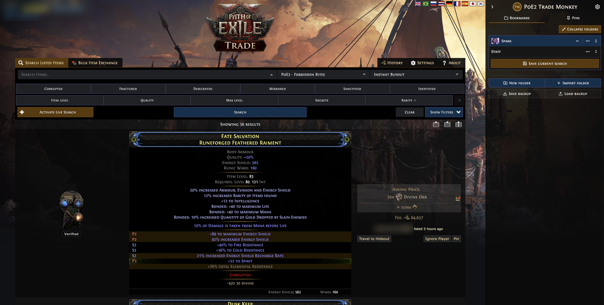
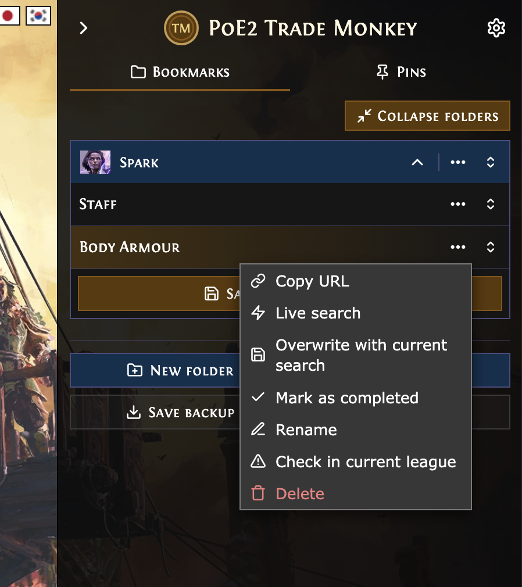
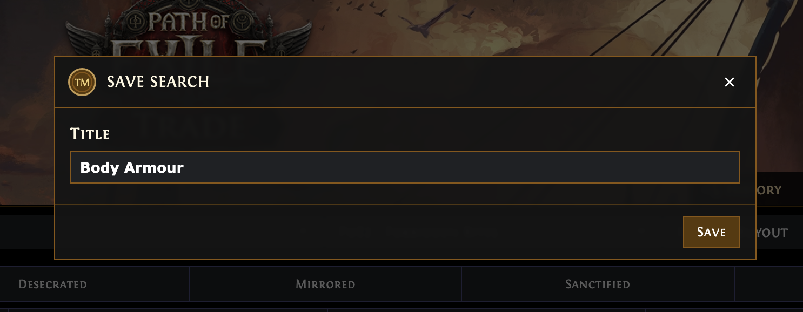
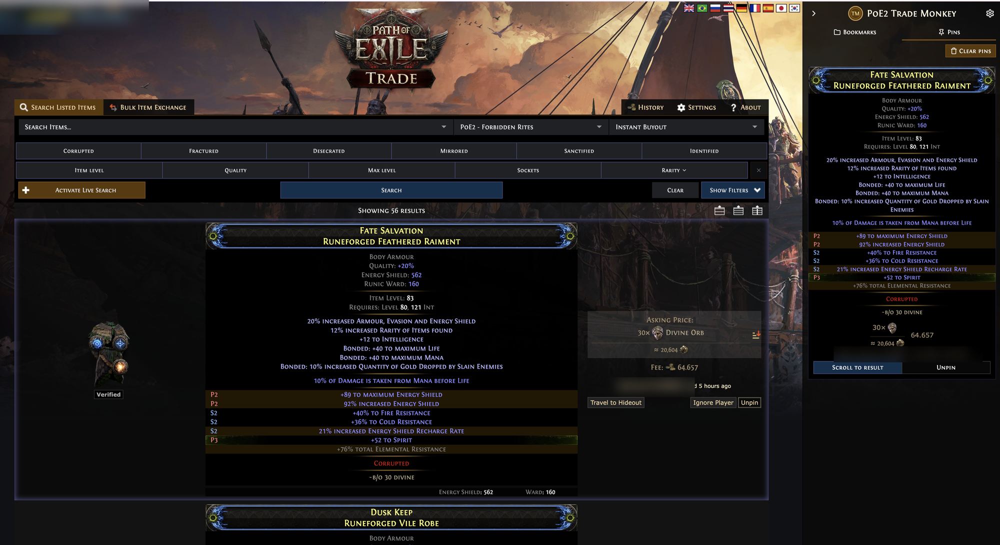
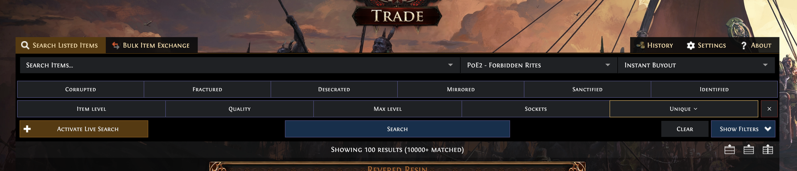
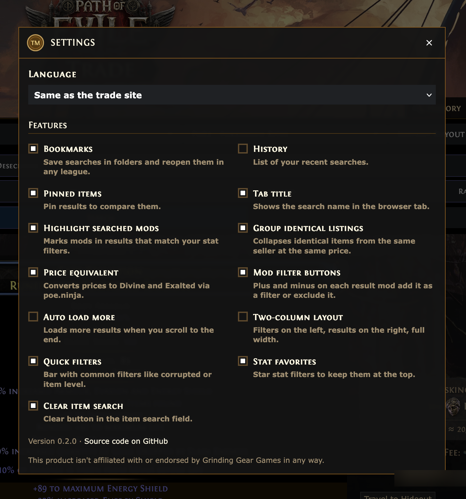

# PoE2 Trade Monkey

A userscript for the [Path of Exile 2 trade site](https://www.pathofexile.com/trade2). It brings
the features of the popular Chrome trade extensions to every browser, Firefox first.

Made for [Violentmonkey](https://violentmonkey.github.io/) in Firefox. It only uses the userscript
API that Tampermonkey and Greasemonkey 4 share, so those should work too.



## Install

1. Install [Violentmonkey for Firefox](https://addons.mozilla.org/firefox/addon/violentmonkey/)
   (other browsers: see [violentmonkey.github.io](https://violentmonkey.github.io/get-it/)).
2. Install the script from
   [Greasy Fork](https://greasyfork.org/en/scripts/598884-poe2-trade-monkey) or directly from
   [GitHub](https://raw.githubusercontent.com/maluramichael/poe2-trade-monkey/master/dist/poe2-trade-monkey.user.js)
   and confirm the install dialog.
3. Open the trade site. The sidebar appears on the right.

Updates install automatically.

**Chrome, Edge and other Chromium browsers:** since Chrome 138, userscript managers only run
scripts after you allow it. Open `chrome://extensions`, click "Details" on Tampermonkey or
Violentmonkey and turn on "Allow User Scripts" (older versions: turn on Developer mode at the top
right). See the [Tampermonkey FAQ](https://www.tampermonkey.net/faq.php?q=Q209).

## Coming from Better Trading?

Your bookmarks come with you. Two ways:

- **Backup file:** export a backup in Better Trading. In Trade Monkey, open the Bookmarks tab and
  click "Load backup" at the bottom. Folders, icons and archived folders are kept.
- **Single folders:** copy a folder's share code in Better Trading and paste it into "Import
  folder".

After that, every saved search opens in the league you are playing now. "Check in current league"
in a bookmark's menu tells you if one of its stats no longer exists.

How it came together: [blog post on malura.de](https://malura.de/en/blog/poe2-trade-monkey-the-chrome-trade-extensions-as-a-userscript-for-firefox)
([Deutsch](https://malura.de/blog/poe2-trade-monkey)).

## Features

Every feature can be switched off in the settings (gear icon in the sidebar).

**Bookmarks**
- Folders with currency or ascendancy icons, drag and drop sorting, archive.
- Save the current search with one click. Searches open in the league you are playing now, so
  your folders work again in every new league. Searches saved in an older league get a badge.
- "Check in current league" warns when a saved search uses stats that no longer exist.
- Share a folder as a code, import codes from Better Trading, back up and restore everything
  (also reads Better Trading backup files).

<p>
  
  
</p>

**History and pins**
- The last 50 searches, reopen them in their league or in the current one.
- Pin results to keep them next to the list while you compare.
- The browser tab shows the bookmark name or the searched item, with ⚡ for live searches.



**Results**
- Mods that match your stat filters are highlighted (exact stat id match).
- "+" and "−" next to every mod add it as a stat filter or exclude it.
- Identical listings from the same seller at the same price are grouped.
- Price equivalent in Divine and Exalted Orbs from [poe.ninja](https://poe.ninja).
- Optional: load more results automatically while scrolling.

**Search form**
- Two-column layout: filters on the left, results on the right, both scroll on their own.
- Quick filter bar: corrupted, fractured, desecrated, mirrored, sanctified, identified,
  item level, quality, level, rune sockets, rarity.
- Star stats in the stat filter dropdown to keep them on top.
- Clear button in the item search field.



The interface follows the trade site's language (German on de.pathofexile.com, otherwise English).



## Also for PoE2

[poe2speedrun.malura.de](https://poe2speedrun.malura.de/) is a campaign speedrun guide made for a
tablet next to the game: route checklist with act timers, every quest with its log steps, and a
reference section. German and English.

## How it works with the trade site

The script only enhances what the site loads anyway. It never sends searches on its own, never
polls the trade API and never clicks whisper or "Travel to Hideout" for you. Filter buttons change
the search form; you still press Search yourself.

Network requests outside pathofexile.com: currency rates from poe.ninja (cached for an hour) and
the folder icons from this repository. Your bookmarks stay in your userscript manager's storage.

## Development

```bash
npm install --ignore-scripts
npm run check      # typecheck, unit tests, build
npm run test:e2e   # Playwright against a recorded copy of the trade page
npm run dev        # rebuild on change
```

Architecture notes, verified facts about the trade site and the live test setup are in
[CLAUDE.md](CLAUDE.md). Each feature lives in its own folder under `src/features/`.

## Credits

- Folder icons from [Better PathOfExile Trading](https://github.com/exile-center/better-trading)
  (MIT), item art © Grinding Gear Games.
- Feature ideas from Better Trading, [TradeUX](https://github.com/tradeux/tradeux) and other trade
  tools. No code from TradeUX is used.
- Icon shapes after [Lucide](https://lucide.dev) (ISC).

## License

MIT, see [LICENSE](LICENSE).

This product isn't affiliated with or endorsed by Grinding Gear Games in any way.
